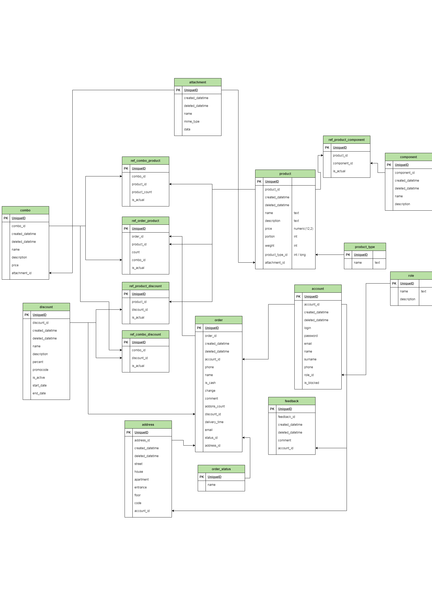

# ProjectT
> link to [front](https://github.com/marinerbob/sush)

Базовая серверная часть для портала по заказу суши

## Installing / Getting started

Modify these options in application.properties and pom.xml to specify database connection
```properties
spring.datasource.url={db_url}
spring.datasource.username={db_login}
spring.datasource.password={db_pass}
```
```xml
<jdbc>
    <driver>org.postgresql.Driver</driver>
    <url>{db_url}</url>
    <username>{db_login}</username>
    <password>{db_pass}</password>
</jdbc>
```

To generate JOOQ data with maven run 
```
jooq-codegen:generate
```


## Database
Postgresql 

<details>
<summary>Database schema</summary>
    

</details>

Use [db_init_script](db_init_testData.sql) to initialize database schema and tables.
If you want you can uncomment inserts blocks which contains test data.